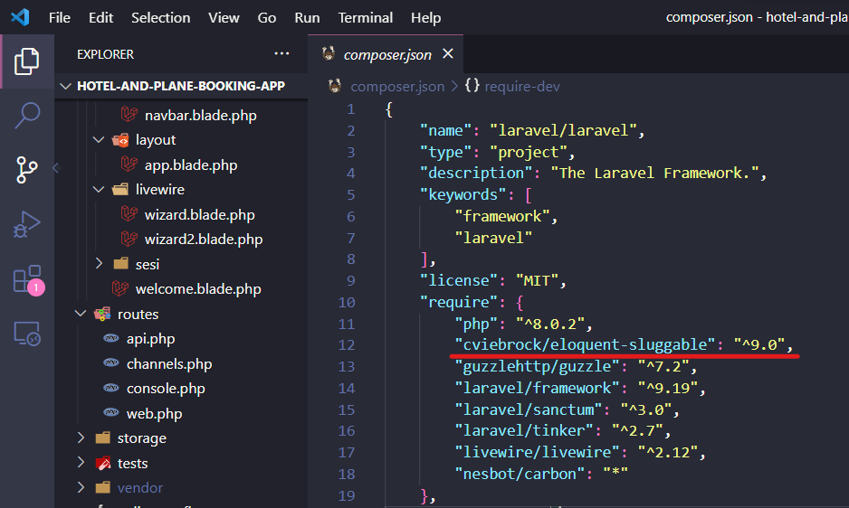

<h1 align="center">🙂🙂🙂</h1>

### habis clone repo ini jangan lupa:
- duplikat file ``.env.example``
- ubah file ``.env copy.example`` jadi ``.env``
- buat database baru pake nama ' bookingApp '
- isi ``DB_DATABASE= `` di file ``.env`` tadi pake nama ' bookingApp '
- Buka terminal terus ketik:
```
composer install
```
- klo udah lanjut
```
npm install
```
- habistu generasi key nya. tutup dulu file ``.env`` tadi terus
```
php artisan key:generate
```
- lanjut install [sluggable](https://github.com/cviebrock/eloquent-sluggable). cek di ``composer.json`` bagian "require" pastiin sudah ada ini <br><br>
</a>
- kalo belum isi dulu kayak gitu
```
"cviebrock/eloquent-sluggable": "^9.0",
```
- lanjut! &nbsp; -- _nb: kalau gabisa di terminal pake Command Prompt_
```
composer require cviebrock/eloquent-sluggable
```
- install juga [livewire](https://laraveltuts.com/laravel-9-livewire-multi-step-form-wizard-tutorial/) &nbsp; -- _nb: kalau gabisa di terminal pake Command Prompt_
``` 
composer require livewire/livewire
```
- terakhir jangan lupa
```
php artisan migrate:fresh --seed
```
> Selamat Mencoba 🙂
